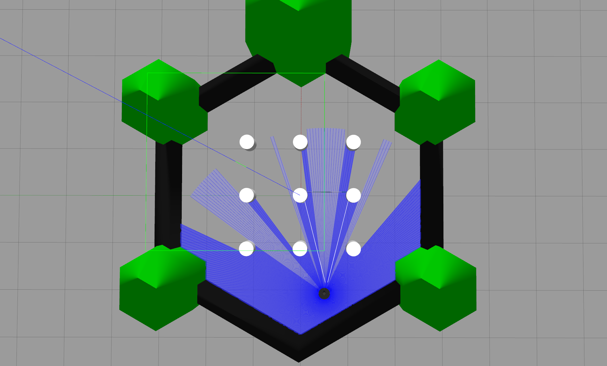

# README.md
<div align="center" style="margin: 20px 0;">
  
</div>

## Install
```bash
git clone git@github.com:Tipriest/vln_gazebo_simulator.git
git submodule update --init --recursive
```

## Build
```bash
colcon build --symlink-install
```


## Usage
```bash
# first use echo to select turtle_robot model
# options: burger, waffle, waffle_pi, etc
export TURTLEBOT3_MODEL=burger

# source
source install/setup.zsh

# launch gazebo world files(optional)
ros2 launch turtlebot3_gazebo empty_world.launch.py
# ros2 launch turtlebot3_gazebo turtlebot3_world.launch.py
# ros2 launch turtlebot3_gazebo turtlebot3_house.launch.py

# launch control method
# use keyboard control
ros2 run turtlebot3_teleop teleop_keyboard
# use joystick control
ros2 launch turtlebot3_gazebo turtlebot3_joystick_ctl.py
```

## Reference
[turtlebot3的官方文档](https://emanual.robotis.com/docs/en/platform/turtlebot3/simulation/#gazebo-simulation)
