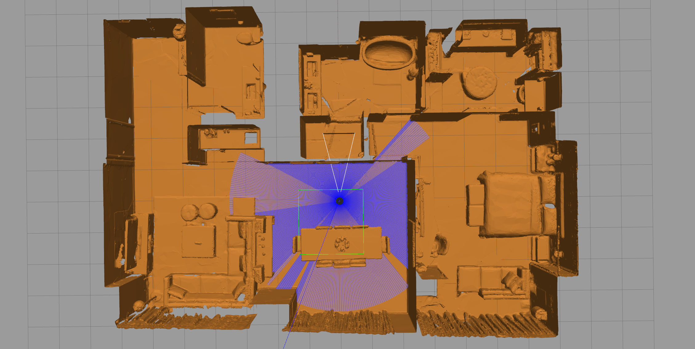

# README.md

<div align="center" style="margin: 20px 0;">
  
</div>

## 一. 项目作用
用于作为一个在ROS2上的基于gazbeo的轮式机器人仿真平台
- 支持切换仿真的机器人模型
  - [TODO] 增加轮式平台的双臂机器人模型
- 支持切换仿真的世界模型
  - 查看是否有将现有的hm3d数据集转换为gazebo环境的办法
  - 如果没有的话，需要自行搭建与hm3d中实际使用的环境相似的sdf环境
- 支持多种操纵方式
  - 基于键盘对小车进行控制
  - 基于手柄对小车进行控制


## 二. 环境安装
> 此设置已在 **Ubuntu 22.04** 和 **ros2 humble** 上通过测试。

### 2.1 克隆带有子模块的仓库
```bash
git clone git@github.com:Tipriest/vln_gazebo_simulator.git
git submodule update --init --recursive
```

### 2.2 编译
```bash
colcon build --symlink-install
```


## 三. 仿真环境使用
```bash
# first use echo to select turtle_robot model
# options: burger, waffle, waffle_pi, etc
export TURTLEBOT3_MODEL=waffle_pi

# source
source install/setup.zsh

# launch gazebo world files(optional)
ros2 launch turtlebot3_gazebo empty_world.launch.py
# ros2 launch turtlebot3_gazebo turtlebot3_world.launch.py
# ros2 launch turtlebot3_gazebo turtlebot3_house.launch.py
# ros2 launch turtlebot3_gazebo turtlebot3_00829.launch.py

# launch control method
# use keyboard control
ros2 run turtlebot3_teleop teleop_keyboard
# use joystick control
ros2 launch turtlebot3_gazebo turtlebot3_joystick_ctl.py
```

## 四. 参考资料
[turtlebot3的官方文档](https://emanual.robotis.com/docs/en/platform/turtlebot3/simulation/#gazebo-simulation)
